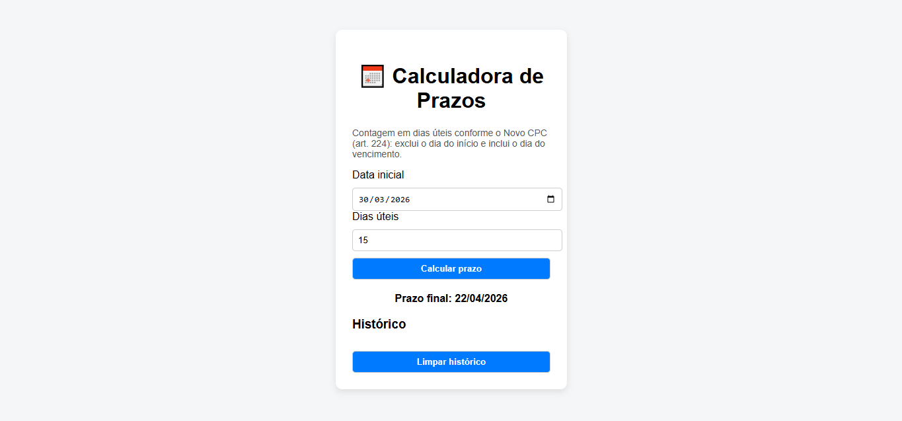

## 📷 Preview

# 📅 Calculadora de Prazos Processuais

Aplicação web desenvolvida em JavaScript para cálculo de prazos processuais em dias úteis, conforme o Novo CPC (art. 224).

## Funcionalidades

* Cálculo de prazos em dias úteis
* Exclusão automática de finais de semana
* Exclusão de feriados (lista configurável)
* Aplicação da regra do CPC (exclui o dia inicial e inclui o final)
* Histórico de cálculos salvo no navegador (localStorage)

## Regras aplicadas

O sistema segue a regra do art. 224 do CPC:

* Exclui o dia do começo
* Inclui o dia do vencimento
* Considera apenas dias úteis

## Tecnologias utilizadas

* JavaScript
* HTML5
* CSS3
* LocalStorage

## Aprendizados

Durante o desenvolvimento deste projeto, pratiquei:

* Manipulação do DOM
* Lógica de programação com datas
* Controle de fluxo (loops e condicionais)
* Tratamento de regras de negócio reais
* Persistência de dados no navegador
* Organização de código em arquivos separados

## Como executar o projeto

1. Baixe ou clone este repositório
2. Abra o arquivo `index.html` no navegador

## Próximas melhorias

* Integração com API de feriados
* Interface mais avançada (UI/UX)
* Transformação em aplicação full stack

